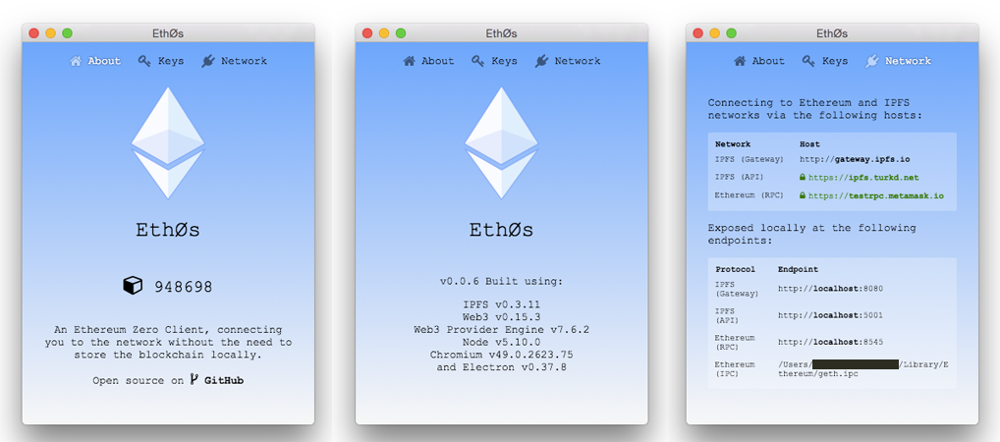

# Eth0s

An Ethereum Zero Client, connecting you to the network without the need to store the blockchain locally.

Releases
--------

For the most recent prebuilt binaries for particular platforms see: [Releases](https://github.com/d11e9/eth0s/releases)

Getting Started
---------------

Once you have the application either by downloading the release for your platform, or building from source (documented below), running it will automatically connect to exteral hosts and connect you to the Ethereum and IPFS networks, as though you were running full nodes for them locally.

#### Wallet

Eth0s has been tested with [Mist/Ethereum-Wallet](https://github.com/ethereum/mist) and does not provide a wallet of its own.

Development
-----------

    git clone https://github.com/d11e9/eth0s.git
    cd eth0s
    npm install
    npm start

#### Nodejs version

When  building/running from source, you need to make use of `n` or `nvm` to run a version of nodejs that matches the version shipped with electron, which i belive is `v5.10.1`

#### Building on windows

Eth0s uses `node-gyp` for some of its depenencies, and so you will have to follow the instructions for setting up the required [VisualStudio and SDK as documented on the `node-gyp` repo](https://github.com/nodejs/node-gyp#installation)
